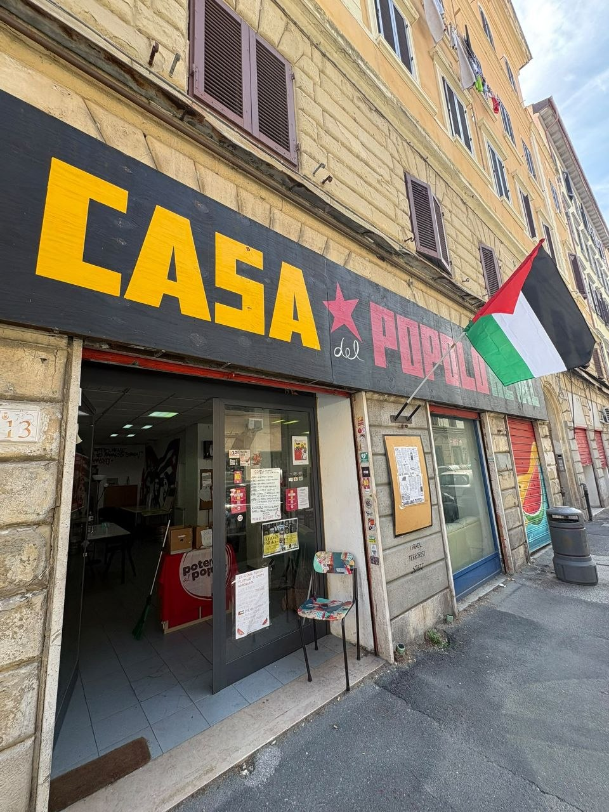
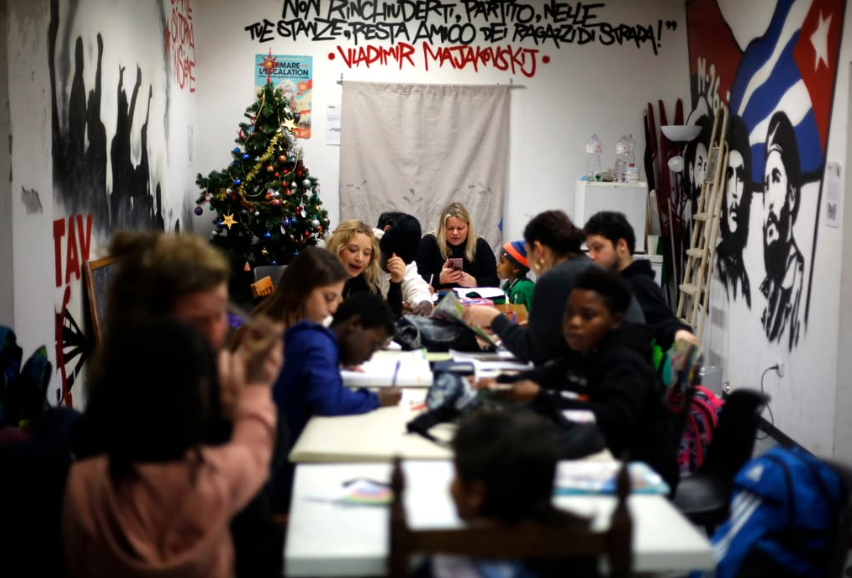

## BIBLIOTECA, STUDIO E SOCIALITÀ
Ogni martedì e ogni giovedì troverai lo spazio aperto dalle 15 per queste attività:
- Prendere in prestito un libro dalla [Biblioteca Heval](/biblioteca/)
- Studiare con altre persone
- Semplicemente conoscere nuove persone.  
 La Casa del Popolo Heval è un luogo di socialità e usare il nostro tempo per rilassarci, conoscere persone nuove e scambiare opinioni (volendo anche davanti un aperitivo) è un modo, nel nostro piccolo, di liberarci dalla cultura performativa del capitalismo.  

## CINEFOOTBALL:
Il cineforum di autofinanziamento del <a href="https://www.instagram.com/football.livorno/" target="_blank" rel="noopener noreferrer">Football Livorno</a>.  
Questa stagione è stato spostato agli <a href="https://www.facebook.com/ortiurbanilivorno/?locale=it_IT" target="_blank" rel="noopener noreferrer">Orti Urbani in Via Goito</a> e si terrà, a partire da luglio, ogni mercoledì dalle ore 21:00.  
Per i dettagli sulla programmazione, clicca qui (fare pagina programmazione).

## DOPOSCUOLA
Il doposcuola svolto in Casa del Popolo Heval è un'attività dell'associazione <a href="https://www.mezclar22.org/" target="_blank" rel="noopener noreferrer">Mezclar</a>. 
Viene svolta durante il periodo scolastico ogni Martedì e Venerdì dalle 16:30 alle 19:00.

