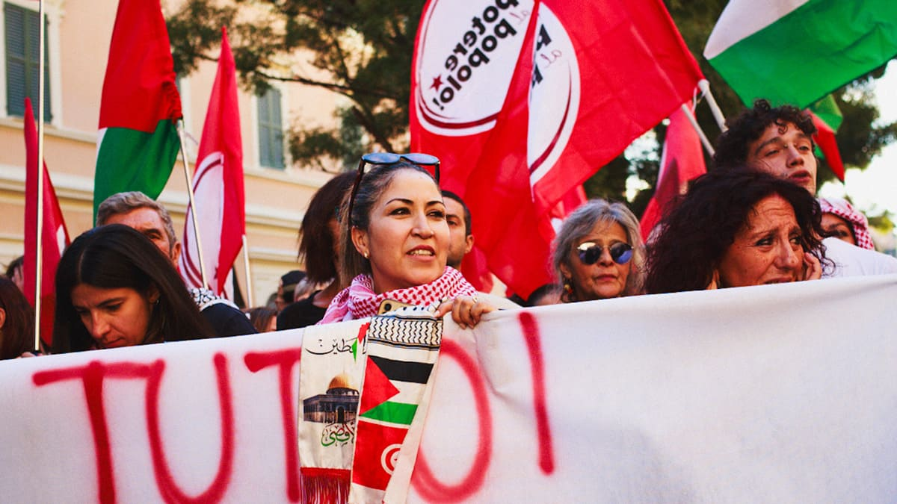
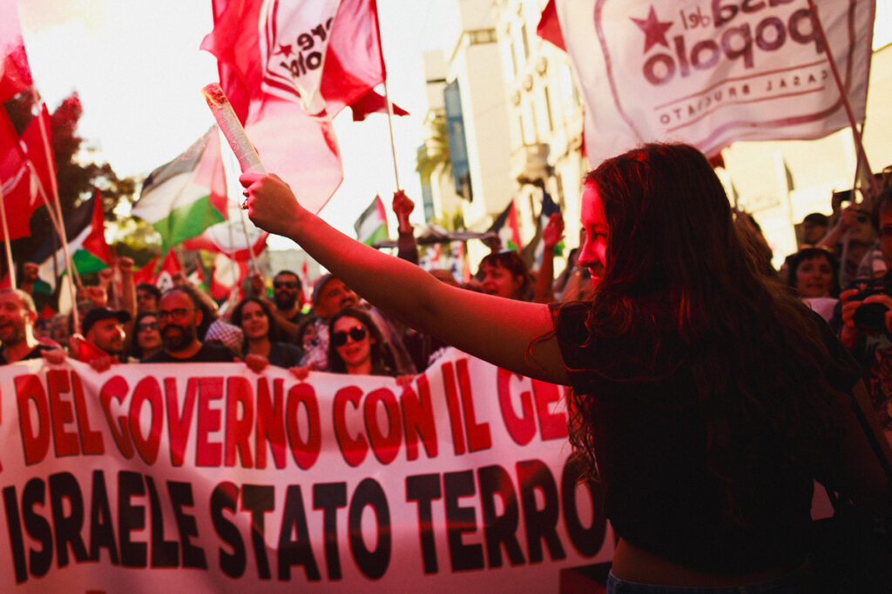
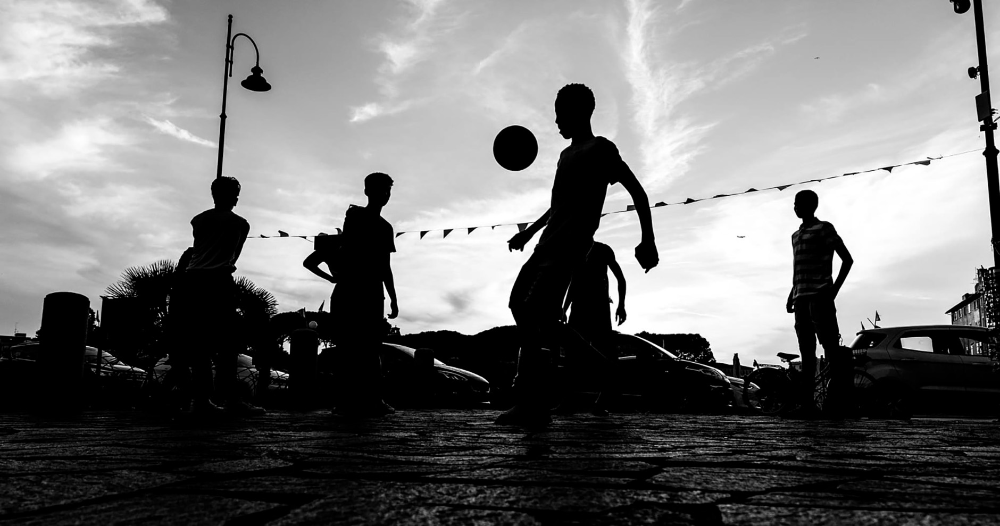

<h2> <a href="https://poterealpopolo.org/" target="_blank" rel="noopener noreferrer">POTERE AL POPOLO </a></h2>

Siamo le giovani e i giovani che lavorano a nero, precari, per 800 euro al mese perché ne hanno bisogno, che spesso emigrano per trovare di meglio. Siamo lavoratori e lavoratrici sottoposte ogni giorno a ricatti sempre più pesanti e offensivi per la nostra dignità, che vedono il proprio salario mangiato da affitti, bollette e spesa sempre più cari. Siamo disoccupate, cassaintegrate, esodati.   Siamo i pensionati che campano con poco anche se hanno faticato una vita e ora non vedono prospettive per i loro figli. Siamo le donne che lottano contro la violenza maschilie, il patriarcato, le disparità di salario a parità di lavoro. Siamo le persone LGBT discriminate sul lavoro e dalle istituzioni. Siamo pendolari, abitanti delle periferie che lottano con il trasporto pubblico inefficiente e la mancanza di servizi. I malati che aspettano mesi per una visita nella sanità pubblica, perché quella privata non possono permettersela. Siamo i migranti che aspettano invano un permesso di soggiorno pur lavorando da anni in Italia.  
Siamo coloro che producono la ricchezza di questo paese.  
Ma siamo anche quelli che non cedono alla disperazione e alla rassegnazione, che non sopportano di vivere in un’Italia sempre più incattivita, triste, impoverita e ingiusta.   Siamo quelli che vogliono liberare le migliori energie di questo paese, gettare a mare una zavorra fatta di corporativismo, di una classe politica e imprenditoriale immorali e corrotte.   Ci impegniamo ogni giorno, organizzandoci in comitati, associazioni, centri sociali, partiti e sindacati, nei quartieri, nelle piazze o sui posti di lavoro, per contrastare la disumanità dei nostri tempi, il cinismo del profitto e della rendita, la barbarie del genocidio e della guerra, le discriminazioni di ogni tipo, lo svuotamento della democrazia.   Per organizzare il futuro.
 

<h2> <a href="https://www.instagram.com/football.livorno/" target="_blank" rel="noopener noreferrer">FOOTBALL LIVORNO </a></h2>
Descrizione Football Livorno con foto

<h2> <a href="https://www.mezclar22.org/" target="_blank" rel="noopener noreferrer">MEZCLAR</a></h2>

Siamo attivə nel quartiere Garibaldi di Livorno con progetti di animazione sociale e culturali legati ad una costante pratica di advocacy sul tema della sostenibilità ecologica e le criticità sociali e politiche legate trasformazioni urbane. Attraverso la rigenerazione di molteplici fondi nella zona, dove sperimentiamo e sviluppiamo idee e pratiche legate all’economia circolare e solidale, cerchiamo di contribuire ad un tipo di rigenerazione urbana che si ponga in ascolto delle criticità sociali che essa genera senza l’equa attuazione di correttivi all’interesse speculativo immobiliare. “La Riuso!” in via della Pina d’Oro è la sede dell’associazione, dove il progetto di economia circolare e solidale vincitore nel giugno 2017 del bando Pop up continua a svolgere il suo doppio ruolo di luogo di raccolta di abiti usati e presidio sociale di quartiere. “Mezclar Cafè” in piazza dei Mille è invece lo spazio culturale ibrido che da due anni ospita live set acustici, mostre, performance musicali e di danza, e che attualmente partecipa al progetto cittadino “Livorno città che legge/La biblioteca va in città”, con la trasformazione di un fondo commerciale sfitto da molti anni in libreria popolare e caffè letterario. “Crema” è la boutiquina de “La Riuso!”, nata ultimamente come piccola appendice vintage del primo progetto, uno spazio creativo di recupero e upcycling degli abiti oltre ad un luogo di ideazione di eventi culturali e artistici.

