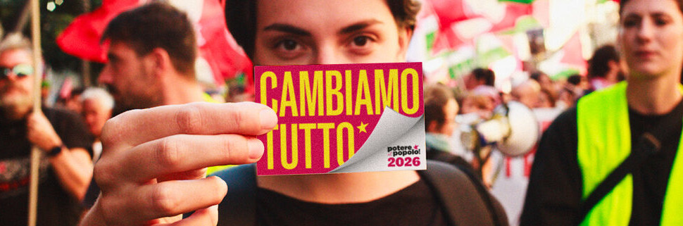

---
#
# Use the widgets beneath and the content will be
# inserted automagically in the webpage. To make
# this work, you have to use › layout: frontpage
#
layout: frontpage
header:
  image_fullwidth: cdph-banner.jpg
widget1:
  title: "Attività"
  url: 'http://phlow.github.io/feeling-responsive/blog/'
  image: widget-1-302x182.jpg
  text: 'Scopri le attività e gli eventi ospitati da questo spazio'
widget2:
  title: "Biblioteca"
  url: 'http://phlow.github.io/feeling-responsive/info/'
  text: 'Scopri i libri che puoi prendere in prestito dalla nostra biblioteca'
  video: ''
widget3:
  title: "Realtà"
  url: 'https://github.com/Phlow/feeling-responsive'
  image: widget-github-303x182.jpg
  text: 'Maggiori informazioni sulle realtà che vivono lo spazio'
#
# Use the call for action to show a button on the frontpage
#
# To make internal links, just use a permalink like this
# url: /getting-started/
#
# To style the button in different colors, use no value
# to use the main color or success, alert or secondary.
# To change colors see sass/_01_settings_colors.scss
#
callforaction:
  url: https://tinyletter.com/feeling-responsive
  text: Dona alla casa del popolo ›
  style: alert
permalink: /index.html
#
# This is a nasty hack to make the navigation highlight
# this page as active in the topbar navigation
#
homepage: true
---

